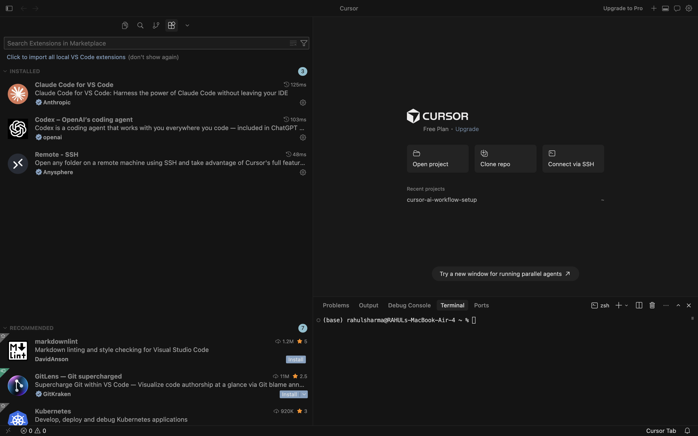
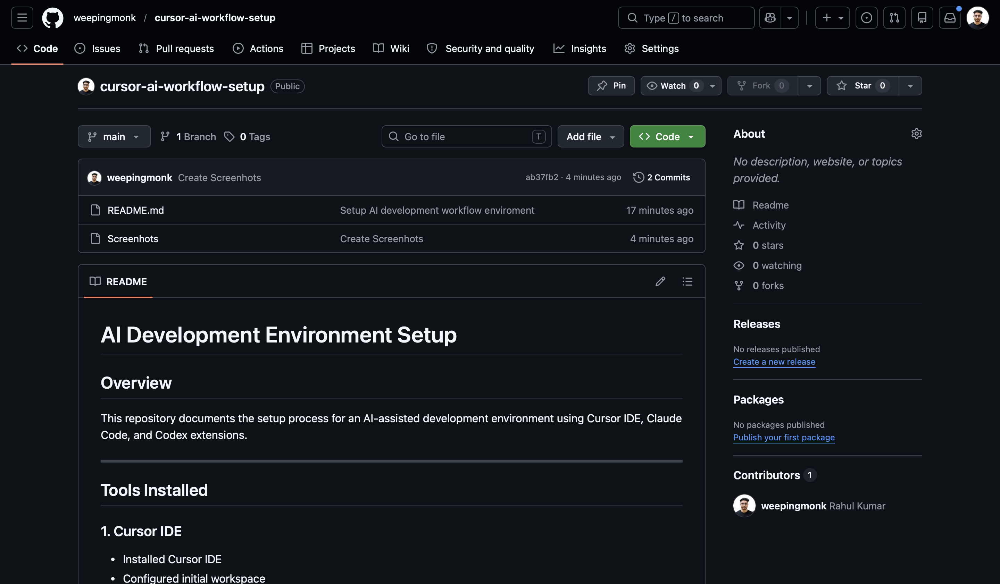

# AI Development Environment Setup

## Overview
This repository documents the setup process for an AI-assisted development environment using Cursor IDE, Claude Code, and Codex extensions.

---

## Tools Installed

### 1. Cursor IDE
- Installed Cursor IDE
- Configured initial workspace

### 2. Claude Code Extension
- Installed via Cursor Extensions Marketplace
- Authenticated successfully

### 3. Codex Extension
- Installed via Cursor Extensions Marketplace
- Connected and verified

---

## Repository Setup

### GitHub Repository
- Created public GitHub repository
- Cloned repository locally
- Opened project in Cursor IDE

---

## Steps Completed

- Installed Cursor IDE
- Installed Claude Code extension
- Installed Codex extension
- Authenticated required accounts
- Created GitHub repository
- Connected local repository
- Created README documentation
- Committed changes using Git
- Pushed repository to GitHub

---

## Challenges Faced

### Extension Authentication Delay
Issue:
- Authentication popup initially failed to load.

Solution:
- Restarted Cursor IDE and re-authenticated successfully.

### Git Configuration
Issue:
- Git identity was not configured locally.

Solution:
```bash
git config --global user.name "Your Name"
git config --global user.email "your@email.com"
```

---

## Git Commands Used

```bash
git init
git remote add origin REPOSITORY_URL
git add .
git commit -m "Initial setup documentation"
git push -u origin main
```

---

## Final Outcome

Successfully configured a modern AI-assisted coding workflow environment using Cursor IDE with Claude Code and Codex integrations.

## Setup Screenshots

### Cursor IDE


### GitHub Repository

